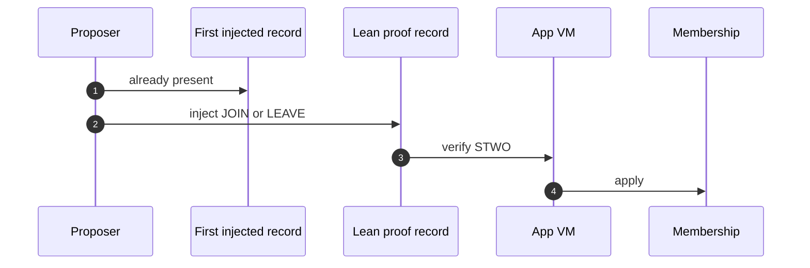
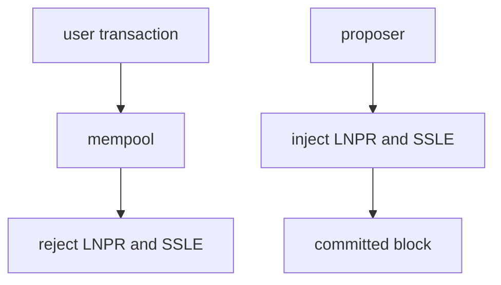

# For engineers

**Terp Lean** is a research product that changes **who may vote** from staked tokens to **membership**. Membership is a **bitfield** (which participants are in) plus each member's **effective balance** (their voting weight). You change that set in three steps: inject, verify, apply.

The public Terp chain (`terpd`) is a different product. This page is the `terpz` binary. You run it locally. It is not a public Lean network.

## Inject, verify, apply

**JOIN** adds a member. **LEAVE** removes one. Those requests are **subjects** on an **LNPR** (Lean proof record). The proposer injects LNPR. Users cannot.

A first injected record already exists: **hashmerchant** (prefix `HMVE`). That record is not Lean membership. LNPR comes after it. Do not replace hashmerchant.

**Dummy proofs** (magic `DSTW`) always fail. Real proofs are **STWO**: prover 2, field **M31** (curve id 5). They are produced off-chain.

**Verify** happens in-process in the **app VM**. That VM is **zk-wasmvm**: a CosmWasm runtime with a host API for proof checks. The native Lean module calls that host API. This is not a stored CosmWasm contract that the chain `sudo`s.

**Apply** writes membership. A new JOIN enters with small voting power so a silent joiner cannot stall the chain. Consensus continues after JOIN. Rewards can still be withdrawn through the usual distribution path.

## Mempool rejects LNPR and SSLE

**SSLE** (single secret leader election) is hide-until-block. It ships in the research image. The public schedule is a **ticket**, not the proposer's address. The committed block reveals the proposer with a STWO SSLE proof. Dummy is not an SSLE proof. Tickets are unique per height.

The mempool rejects user LNPR and user SSLE. Those records are proposer-injected only.

## Wire

| Thing | Value |
|---|---|
| Hashmerchant prefix | `HMVE` (`0x484D5645`) |
| LNPR prefix | `LNPR` (`0x4C4E5052`) |
| JOIN / LEAVE subjects | `JOIN` / `LEAV` + `ver=1` + period + subject (JOIN also carries weight) |
| Period | `height / 600` |
| Dummy magic | `DSTW` — always fail |
| Fold / SSLE proofs | `STWO`, `prover_id=2`, `curve_id=5` (M31) |
| SSLE prefix | `SSLE` — ticket, then reveal on commit |

See [LNPR](/research/protocol/lnpr), [Fold](/research/protocol/fold), [Membership](/research/protocol/membership), and [SSLE](/research/protocol/ssle). Run it locally on `terpnetwork/terp-core:terpz-lean`.
