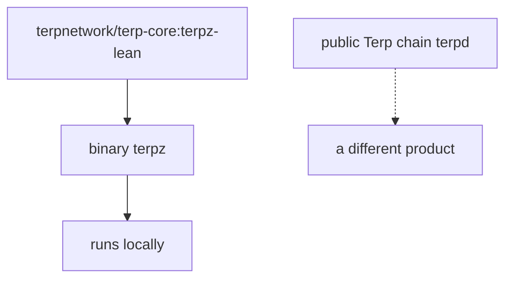

# For operators

**Terp Lean** is a research product that decides who may vote from **membership**, not from how many tokens someone staked. You run it locally so you can see membership, proofs, and proposer tickets. It is not a public Lean network.

You run the **`terpz`** image locally. You do not point a wallet at a public Lean chain.

## What you run

The image is `terpnetwork/terp-core:terpz-lean`. The binary is **`terpz`**.

The public Terp chain uses **`terpd`**. That is a different product. Leave it alone.

When Lean owns the validator set, who may vote is **membership**: a **bitfield** of participants plus each member's **effective balance** (voting weight). That is not “how many tokens they staked.”

**JOIN** adds a member. **LEAVE** removes one. A new JOIN enters with small voting power so a silent joiner cannot stall the chain. Consensus continues after JOIN. Rewards can still be withdrawn through the usual distribution path.

## What you see

The proposer injects an **LNPR** (Lean proof record). **SSLE** (single secret leader election) is hide-until-block and ships in this image: the public schedule is a **ticket**, not an address. The committed block reveals the proposer with a real **STWO** proof. Dummy proofs fail. Dummy is not STWO. Users cannot put LNPR or SSLE in the mempool.

Read [Verify](/research/verify) for the local procedure. Read [Status](/research/status) before you quote a result. Read [SSLE](/research/protocol/ssle) if you need the ticket vs address split.

## What you do not do

- You do not advertise a public Lean validator set.
- You do not point Keplr, Leap, or any wallet at a Lean “mainnet.”
- You do not treat Dummy proofs as STWO.
- You do not treat staked token counts as Lean membership.

You run a local research node. You do not operate a public Lean chain.
