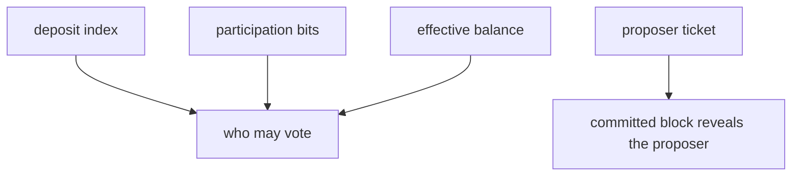

# For researchers

**Terp Lean** is a research product that shrinks validator accounting. Consensus stores a small row per member, proves participation with bits, and hides the proposer until the block commits. The public Terp chain (`terpd`) is a different product. You run `terpz` locally. It is not a public Lean network.

This page maps those objects to the **Extremely Lean Chain** idea: deposit index, effective balance, bitfields, and a hidden proposer. You do not need the original thread to read it.

## The objects

A **deposit index** is who you are in the registry. Consensus stores that index. It does not store a large public key as the row.

**Effective balance** is voting weight. It is not “how many tokens this account staked.”

A **bitfield** is a packed set of bits. Each bit is a participant. Attestations merge with OR: once a bit is on, it stays on for that object.

**Hidden proposer** means the public schedule does not name who will propose. Terp Lean ships that object as **SSLE** (single secret leader election), implemented as **hide-until-block**.

When Lean owns the validator set, **membership** is the bitfield plus each member's effective balance. That set is who may vote.

## What Terp Lean binds

**JOIN** and **LEAVE** flip membership bits. They travel as subjects on an **LNPR** (Lean proof record) that the proposer injects. Users cannot put LNPR in the mempool.

Proofs that count are **STWO**: prover 2, field **M31** (curve id 5). **Dummy proofs** (magic `DSTW`) always fail. Dummy is not STWO. Proofs are produced off-chain and verified in-process by the app VM. The native module calls that host API. This is not a stored CosmWasm contract `sudo`.

SSLE hide-until-block: the public schedule is a **ticket**, not the proposer's address. The committed block reveals the proposer with a STWO SSLE proof. Dummy is not an SSLE proof. Tickets are unique per height. Users cannot put SSLE in the mempool.

A new JOIN enters with small voting power so a silent joiner cannot stall the chain. Consensus continues after JOIN. Rewards can still be withdrawn through the usual distribution path.

| Idea | Terp Lean object |
|---|---|
| Deposit index | Index in the membership row |
| Effective balance | Voting weight per member |
| Participation bitfields | Membership bits JOIN and LEAVE flip |
| Hidden proposer | SSLE ticket until the block; STWO proof on commit. Shipped. |

That mapping is smaller than a full period balance-walk over a million validators. It does not re-key the whole registry every day. Consensus rounds still follow the existing engine.

Start at [Bitfield](/research/protocol/bitfield), [Membership](/research/protocol/membership), [Fold](/research/protocol/fold), and [SSLE](/research/protocol/ssle). [Resources](/research/resources) cites the Extremely Lean Chain thread if you want the source idea.
