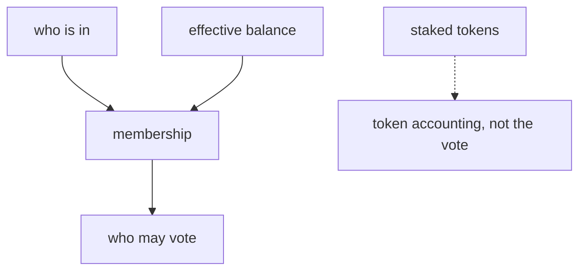
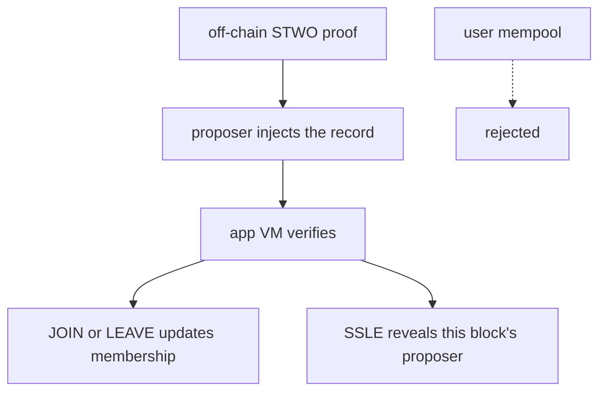

# Terp Lean

Terp Lean is a research product that changes **who may vote** in consensus.

On most Cosmos chains, voting power is how many tokens a validator staked. Terp Lean replaces that with **membership**: a **bitfield** of participants plus each member's **effective balance**. Stake still exists for token accounting. It is not who may vote when Lean owns the validator set.

The binary is `terpz`. The image is `terpnetwork/terp-core:terpz-lean`. The public Terp chain (`terpd`) is a different product. There is no public Lean network. You run this locally.

## Why membership, not stake

When Lean owns the validator set, who may vote is the membership object.

- The **bitfield** says who is in.
- **Effective balance** is each member's voting weight inside that set.
- **JOIN** and **LEAVE** change membership.

Staked tokens can still bond, unbond, and withdraw rewards through the usual distribution path. Those token rows are not the Lean vote.

A new JOIN enters with small voting power. A silent joiner cannot stall the chain. Consensus continues after JOIN.

Membership is who is in plus each member's effective balance. Staked tokens stay token accounting.

## How proofs fit

JOIN and LEAVE travel as subjects on a proposer-injected proof record (**LNPR**). Users cannot put LNPR in the mempool.

**Dummy** proofs (magic `DSTW`) always fail. Real proofs are named **STWO**: prover 2, field M31 (curve id 5). They are produced off-chain and verified in-process by the app VM (the zk-wasmvm host API). The native module calls that API. This is not a stored CosmWasm contract `sudo`.

See [LNPR](/research/protocol/lnpr) for the inject record. See [Fold](/research/protocol/fold) for how STWO proofs compose.

## How SSLE fits

**SSLE** (single secret leader election) hides who will propose until the block commits. Terp Lean implements that as **hide-until-block**. It ships in the research image.

The public schedule is a **ticket**, not a proposer address. Tickets are unique per height. The committed block reveals the proposer with a STWO SSLE proof. Dummy is not an SSLE proof. Users cannot put SSLE in the mempool.

See [SSLE](/research/protocol/ssle).

The proposer injects LNPR and SSLE. The app VM verifies STWO. Users cannot submit either record.

## Who should read which page

### [For researchers](/research/for-researchers)

Map membership, proofs, and SSLE to the intended Lean statement. Start here if you already read the papers.

### [For engineers](/research/for-engineers)

Name inject, verify, and apply. Read this before you touch the module.

### [For operators](/research/for-operators)

Run `terpz` locally. You do not point a wallet at a Lean public set.

### Protocol

- [Bitfield](/research/protocol/bitfield) — who is in
- [Membership](/research/protocol/membership) — JOIN, LEAVE, and effective balance
- [LNPR](/research/protocol/lnpr) — the proposer-injected proof record
- [Fold](/research/protocol/fold) — Dummy vs named STWO
- [SSLE](/research/protocol/ssle) — ticket in, proposer out at commit

### Check what is real

- [Status](/research/status) — shipped, not built yet, not on the public network
- [Verify](/research/verify) — how you run the local image
- [Timeline](/research/timeline) — product locks, not a changelog
- [Resources](/research/resources) — papers and named design notes
- [Glossary](/research/glossary) — product words on first use

## Other research

**re-zerve** is a separate research product: a public compute ask with an encrypted bid and a commitment-only chain record. See [re-zerve](/research/re-zerve).
