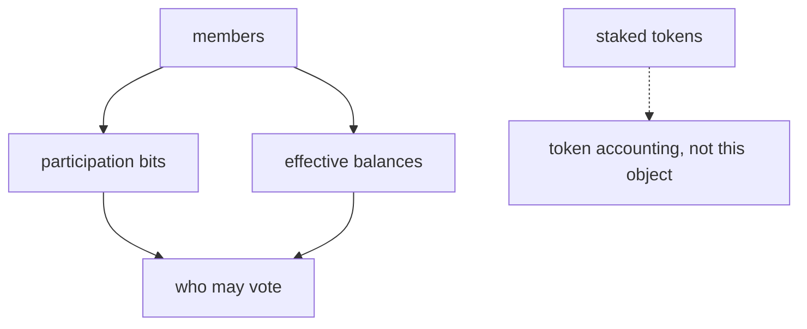

# Bitfield

**Terp Lean** is a research product on an isolated fork of terp-core. It exists so consensus can answer *who may vote* without walking a token-share tree.

When Lean owns the validator set, the answer is **membership**. Membership is a **bitfield** of participants plus each member's **effective balance**. It is not how many tokens they staked.

A **bitfield** is a packed row of bits, one per member. A set bit means that member is in the vote set. **Effective balance** is the voting weight Lean assigns that member.

The public Terp chain uses a different binary, `terpd`, and still keys power off stake. Lean's binary is `terpz`. You run it locally. It is not a public Lean network.

## How the bits work

Attestations combine with OR. Once a member is marked present, they stay marked. You prove the participation branches that happened. You do not prove every absentee as a separate branch.

Bits plus balances decide who may vote. Staked tokens can still exist as token accounting. They are not Lean membership.

## What can go wrong

- Treating a staking `create-validator` as a vote-set change. The staking row can grow while the bitfield stays put. See [Membership](/research/protocol/membership).
- Giving a new joiner full voting power before they vote. JOIN enters small so a silent joiner cannot stall the chain.
- Updating bits from a Dummy proof. Dummy proofs always fail. Real proofs are [STWO](/research/protocol/fold). Dummy is not STWO.

JOIN and LEAVE reach this object as subjects on [LNPR](/research/protocol/lnpr), the proof record the block proposer injects.
