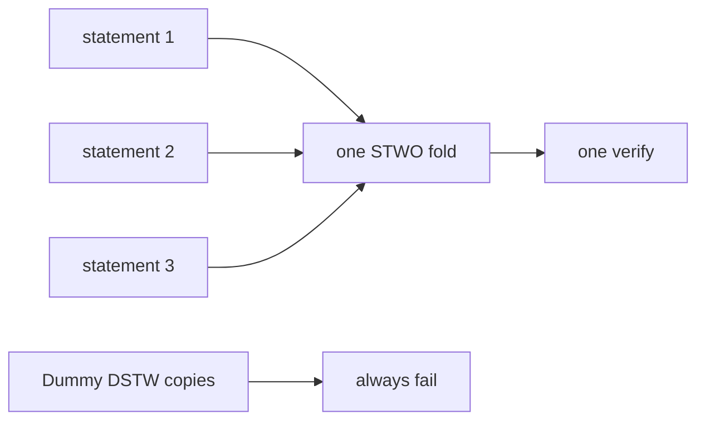

# Fold

**Terp Lean** is a research product that decides who may vote from membership, not from staked tokens. A **fold** is many statements checked with one verify, so the chain does not run a separate proof check for every leaf.

**STWO** is the named proof system: prover 2, field **M31** (curve id 5). Proofs are produced off-chain. They are verified in-process by the **app VM**. That VM is zk-wasmvm: the host API already running inside the `terpz` process. The native Lean module calls that API. This is not a stored CosmWasm contract `sudo`.

**Dummy** proofs use magic `DSTW`. They always fail. Concatenating Dummy proofs is not a fold. Dummy is not STWO.

The public Terp chain (`terpd`) is a different product. You run this locally.

Same-kind statements compose, then one verify. Dummy copies are rejected.

## What can go wrong

- Calling Dummy a STWO proof because both can stamp prover 2 and curve 5. The magic bytes decide: `STWO` versus `DSTW`.
- Concatenating N Dummy proofs and treating the blob as a fold. That must fail.
- Instantiating a stored CosmWasm contract and treating that as verify. The native module calls the host API.

See [LNPR](/research/protocol/lnpr) for where proofs ride. See [SSLE](/research/protocol/ssle) for a STWO proof that reveals the proposer.
