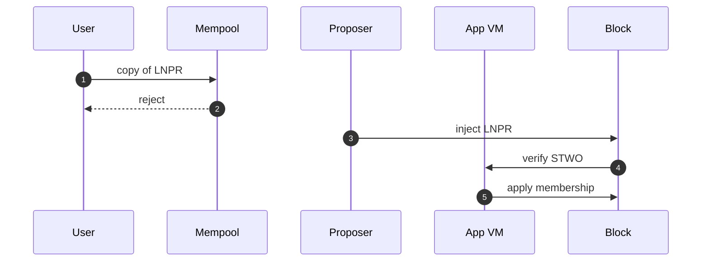

# LNPR

**LNPR** is the Lean proof record the block proposer injects. It exists so membership changes and proofs land in a committed block without traveling as ordinary user transactions.

**Terp Lean** is the research product whose binary is `terpz`. **JOIN** adds a member. **LEAVE** removes one. Those requests travel as **subjects** on LNPR — one membership change per subject the proposer includes.

Users cannot put LNPR in the mempool. They also cannot put [SSLE](/research/protocol/ssle) there. The node rejects both before they enter the mempool.

The proposer injects the record. The native Lean module verifies the **STWO** proof in-process by calling the **app VM** host API (zk-wasmvm). This is not a stored CosmWasm contract `sudo`. Apply then writes membership.

**Dummy** proofs (magic `DSTW`) always fail. Dummy is not STWO.

The public Terp chain (`terpd`) is a different product. You run this locally. It is not a public Lean network.

User copies fail at the mempool. Only the proposer injects the record. The app VM verifies STWO.

## What can go wrong

- Accepting a user-broadcast LNPR. Inject-class data must not sit in the mempool.
- Treating Dummy `DSTW` bytes on an LNPR as a real proof. Dummy proofs always fail. Real proofs are [STWO](/research/protocol/fold).
- Expecting JOIN to work as a normal staking message. `create-validator` does not flip membership. See [Membership](/research/protocol/membership).

You can run this locally on image `terpnetwork/terp-core:terpz-lean`.
