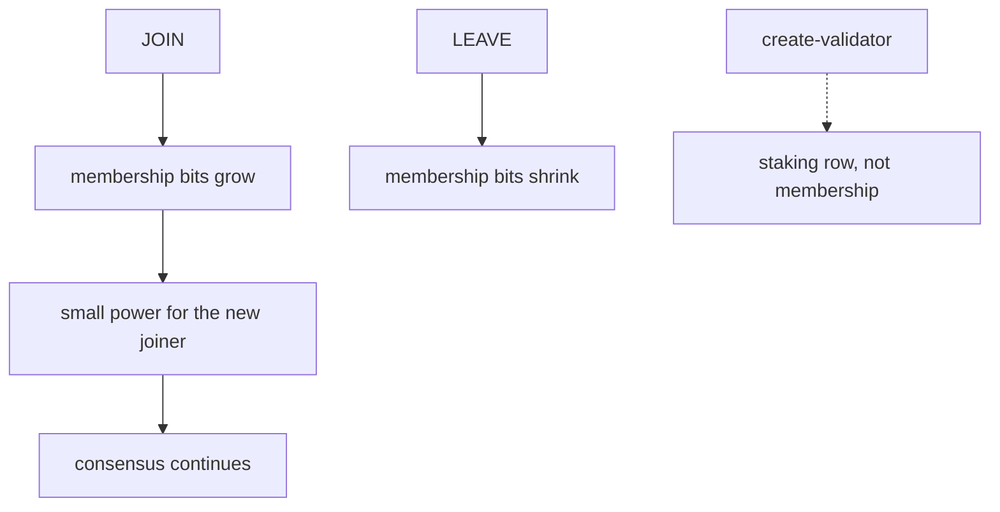

# Membership

**Membership** is who may vote when Terp Lean owns the validator set. Terp Lean is a research product on an isolated fork of terp-core. It exists so the vote set is a [bitfield](/research/protocol/bitfield) of participants plus each member's **effective balance** — the voting weight Lean assigns — not how many tokens they staked.

**JOIN** adds a member. **LEAVE** removes one. Those requests travel as subjects on [LNPR](/research/protocol/lnpr), the proof record the block proposer injects. Users cannot put LNPR in the mempool.

A new JOIN enters with **small voting power**. A silent joiner — someone in the set who never votes — cannot stall the chain. Consensus continues after JOIN.

Rewards can still be withdrawn through the usual distribution path. Token accounting in staking can still exist. That is not membership.

The public Terp chain (`terpd`) is a different product. You run binary `terpz` locally. It is not a public Lean network.

JOIN and LEAVE move the bitfield. A staking-only validator is not a Lean member.

## What can go wrong

- Admitting several full-power joiners who do not vote. Two-thirds of voting power must still be online. Small entry power is the stall brake.
- Treating a staking `create-validator` as JOIN. The staking row can grow while the bitfield stays put.
- Stopping block production while a JOIN is in flight. Consensus continues.

You run this locally with image `terpnetwork/terp-core:terpz-lean`.
