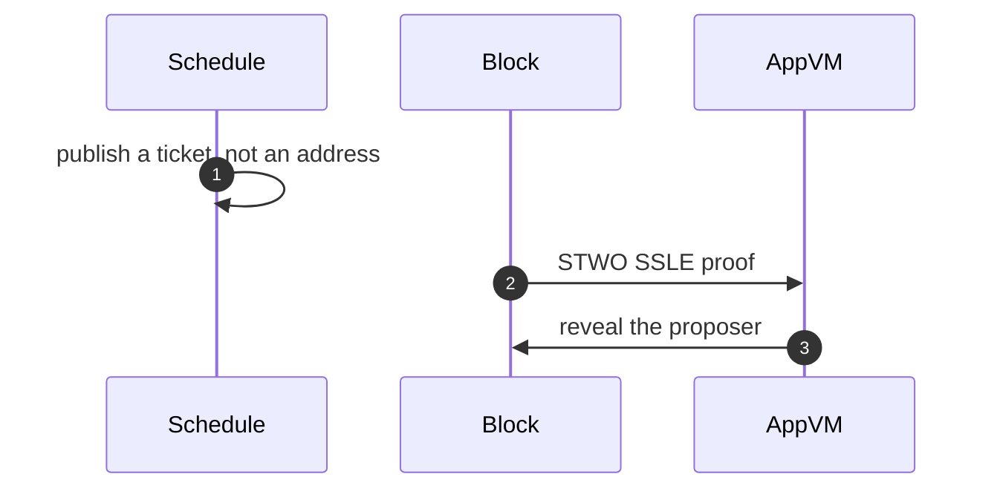

# SSLE

**SSLE** (single secret leader election) hides who will propose until the block lands. Terp Lean implements that as **hide-until-block**. It ships in the research image (`terpz`, `terpnetwork/terp-core:terpz-lean`).

The public schedule is a **ticket**, not the proposer's address. The committed block reveals the proposer with a **STWO** SSLE proof (prover 2, field **M31**, curve id 5). The native module verifies that proof in-process by calling the **app VM** host API. This is not a stored CosmWasm contract `sudo`.

**Dummy** proofs (magic `DSTW`) are not SSLE proofs and not STWO proofs. They always fail. Tickets are unique per height.

Users cannot put SSLE in the mempool. The proposer injects it. Same rule as **LNPR** (the Lean proof record that carries JOIN and LEAVE).

The public Terp chain (`terpd`) is a different product. You run this locally. It is not a public Lean network.

A Dummy blob, a ticket that equals the proposer, a STWO proof of the wrong kind, or a replay does not enter the mempool. After that flood, the chain still produces blocks and still injects a real STWO SSLE.

See [Verify](/research/verify) for the SSLE window check. See [LNPR](/research/protocol/lnpr) for the inject class. See [Resources](/research/resources) for the SSLE paper.
