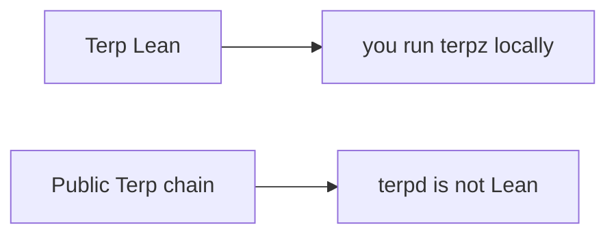

# Status

**Terp Lean** is a research product for proof-carried validator membership. It exists so a chain can decide who may vote from a membership object, not from how many tokens they staked. You run it locally. It is not a public Lean network.

The binary is **terpz**. The image is `terpnetwork/terp-core:terpz-lean`. The public Terp chain runs a different product: **terpd**. That chain stays that way.

**Membership** is who may vote: a **bitfield** of participants plus each member's **effective balance**. **JOIN** and **LEAVE** change membership. Those requests travel as subjects on a proposer-injected proof record (**LNPR**). Users cannot put LNPR in the mempool.

**Dummy** proofs (magic `DSTW`) always fail. Real proofs are named **STWO**: prover 2, field **M31** (curve id 5). They are produced off-chain and verified in-process by the **app VM** (the zk-wasmvm host API). The native module calls that API. This is not a stored CosmWasm contract `sudo`. Dummy is not STWO.

**SSLE** (single secret leader election) is hide-until-block. It ships in the research image. The public schedule is a **ticket**, not the proposer's address. The committed block reveals the proposer with a STWO SSLE proof. Dummy is not an SSLE proof. Tickets are unique per height. Users cannot put an SSLE proof in the mempool.

A new JOIN enters with small voting power so a silent joiner cannot stall the chain. Consensus continues after JOIN. Rewards can still be withdrawn through the usual distribution path.

## How to read the table

- **Works today** — shipped in the research image.
- **Not built yet** — named as missing. It is not in `terpz`.
- **Public network** — whether the public `terpd` chain runs it.

## Scan table

| Capability | Works today | Not built yet | Public network |
|---|---|---|---|
| Membership as who may vote | Yes | — | No |
| JOIN and LEAVE on LNPR | Yes | — | No |
| Users cannot put LNPR or SSLE in the mempool | Yes | — | No |
| Dummy proofs (`DSTW`) always fail | Yes | — | No |
| In-process STWO via the app VM | Yes | — | No |
| SSLE hide-until-block | Yes | — | No |
| JOIN without stalling | Yes | — | No |
| Reward withdraw through distribution | Yes | — | No |
| Daily re-anon keys | — | Yes | No |
| Million-validator period proofs | — | Yes | No |
| A public Lean network | — | Yes | Public chain is not Lean |

Still missing by name: daily re-anon keys, million-validator period proofs, and a public Lean network.
