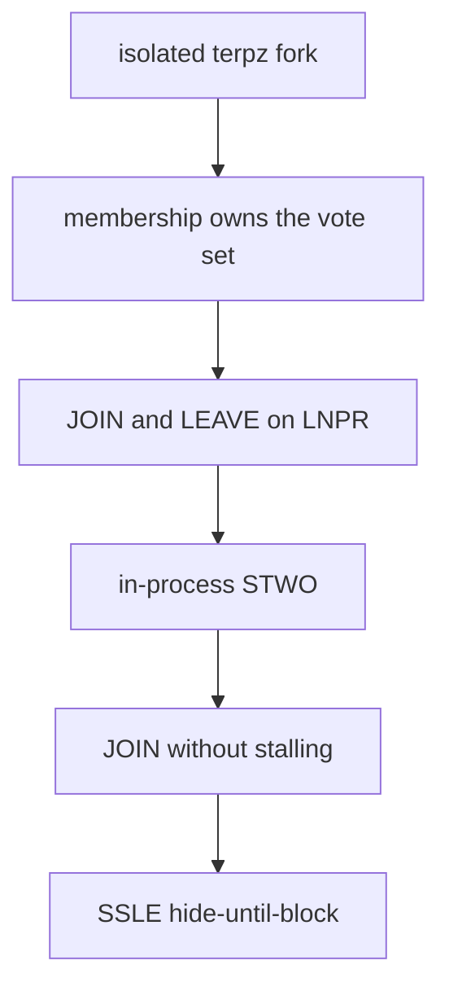

# Timeline

**Terp Lean** is a research product on an isolated fork of **terp-core**. It exists so a chain can decide who may vote from a membership object, not from how many tokens they staked. The binary is **terpz**. The image is `terpnetwork/terp-core:terpz-lean`. The public Terp chain (**terpd**) is a different product and stays that way.

You run this locally. It is not a public Lean network.

**Membership** is who may vote: a **bitfield** plus each member's **effective balance**. **JOIN** and **LEAVE** travel as subjects on a proposer-injected proof record (**LNPR**). Real proofs are **STWO** (prover 2, field **M31**). **SSLE** (single secret leader election) hides the proposer until the block. Dummy proofs always fail. Dummy is not STWO.

## Isolated research product

Lean lives on a fork. `terpz` is the research binary. `terpd` is the public chain. Mixing the two is a product error.

## Membership owns the vote

When Lean owns the validator set, **membership** is who may vote: a **bitfield** of participants plus each member's **effective balance**. Token stake shares are not that object.

## JOIN and LEAVE on LNPR

**JOIN** and **LEAVE** change membership. Those requests travel as subjects on a proposer-injected proof record (**LNPR**). Users cannot put LNPR or SSLE in the mempool.

## Dummy fails; STWO verifies in process

**Dummy** proofs (magic `DSTW`) always fail. Real proofs are named **STWO**: prover 2, field **M31** (curve id 5). They are produced off-chain and verified in-process by the **app VM** (the zk-wasmvm host API). The native module calls that API. This is not a stored CosmWasm contract `sudo`.

## JOIN without stalling

A new JOIN enters with small voting power so a silent joiner cannot stall the chain. Consensus continues after JOIN. Rewards can still be withdrawn through the usual distribution path.

## SSLE hide-until-block

**SSLE** (single secret leader election) is hide-until-block. It ships in the research image. The public schedule is a **ticket**, not the proposer's address. The committed block reveals the proposer with a STWO SSLE proof. Dummy is not an SSLE proof. Tickets are unique per height.

## Not a public Lean network

Still missing by name: daily re-anon keys, million-validator period proofs, and a public Lean network. The public `terpd` chain is not this product.
