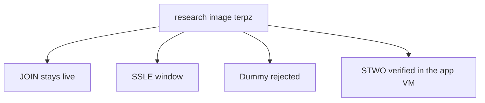

# Verify

**Terp Lean** is a research product that lets a chain decide who may vote from **membership**, not from how many tokens someone staked. Membership is a bitfield of participants plus each member's **effective balance** (the voting weight Lean actually uses). You reproduce that product locally. You do not join a public Lean network.

The binary is `terpz`. The image is `terpnetwork/terp-core:terpz-lean`. The public Terp chain (`terpd`) is a different product. Leave it alone.

## What you are checking

You check four behaviors:

1. **JOIN liveness.** A **JOIN** is a request to enter the membership set. A **LEAVE** is a request to exit it. Those requests travel as subjects on a proposer-injected **LNPR** (Lean proof record). A new JOIN enters with small voting power, so a silent joiner cannot stall the chain. Blocks keep coming after JOIN. Rewards can still be withdrawn through the usual distribution path.
2. **SSLE window.** **SSLE** (single secret leader election) is hide-until-block. It ships in the research image. The public schedule is a **ticket**, not the proposer's address. Each committed block reveals the proposer with a **STWO** SSLE proof. Tickets are unique per height.
3. **Dummy reject.** A **Dummy** proof is the named fake with magic `DSTW`. Dummy always fails. Dummy is not an SSLE proof and not a STWO proof.
4. **STWO via the app VM.** A real proof is named **STWO**: prover 2, field **M31** (curve id 5). The prover runs off-chain. The native module verifies in-process through the **app VM** host API (**zk-wasmvm**, the proof-verify host inside the `terpz` process). This is not a stored CosmWasm contract `sudo`.

Users cannot put LNPR or SSLE in the mempool. Only the proposer injects those records.



When Lean owns the validator set, consensus voting power is that membership object. Staking token shares are not the vote list.

## What success looks like

- After JOIN, height still advances. The new member's voting power is small.
- Several consecutive heights each carry one STWO SSLE record. The ticket is not the proposer. Tickets do not repeat. The proof is not Dummy.
- A Dummy blob (`DSTW`) is rejected. A STWO fold or SSLE with Dummy inside is rejected.
- A STWO proof with prover 2 and M31 (curve id 5) verifies inside the running app VM.
- A raw LNPR or SSLE sent as a user transaction is rejected from the mempool.

This is a local research image. It is not a public Lean chain.

## Commands

You need Docker and the research image. From a checkout of the isolated Lean fork:

```sh
# Full image check: JOIN / LEAVE, Dummy reject, STWO, SSLE window
cd crates/ict-rs/ict-rs-cw-orch
ICT_LEAN_IMAGE=terpnetwork/terp-core:terpz-lean \
ICT_LEAN_OWNS_VALSET=true \
  cargo run --example lean_production_e2e --features docker
```

Default topology for that run is 2 validators and 2 full nodes. Lean owns the validator set. JOIN and LEAVE are broadcast to every validator RPC.

```sh
# SSLE window: consecutive hide-until-block reveals, unique tickets, Dummy flood rejected
cd crates/ict-rs/ict-rs-cw-orch
ICT_LEAN_IMAGE=terpnetwork/terp-core:terpz-lean \
ICT_LEAN_VALS=4 ICT_LEAN_SSLE_WINDOW=12 \
  cargo run --example lean_ssle_load --features docker
```

```sh
# JOIN liveness: small-power JOIN, chain keeps producing, distribution withdraw still works
cd crates/ict-rs/ict-rs-cw-orch
ICT_LEAN_IMAGE=terpnetwork/terp-core:terpz-lean \
ICT_LEAN_OWNS_VALSET=true \
  cargo run --example lean_testnet_gates --features docker
```

If you do not have the image yet, build it from the Lean fork (`make docker-terpz`) and tag it `terpnetwork/terp-core:terpz-lean`. These examples start a real Docker chain. They do not accept a mock runtime.

See [Membership](/research/protocol/membership) for JOIN and LEAVE. See [SSLE](/research/protocol/ssle) for hide-until-block. See [Fold](/research/protocol/fold) for STWO versus Dummy. See [Status](/research/status) for what is local versus the public Terp chain.
